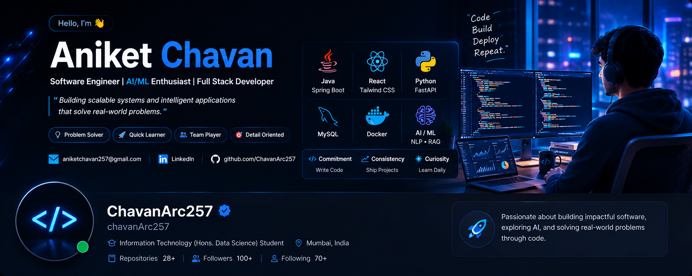

<div align="center">



</div>

<h1 align="center">Hi 👋, I'm Aniket Chavan</h1>

<h3 align="center">
Software Engineer | Full-Stack Developer | AI/ML Enthusiast
</h3>

<p align="center">
  <a href="https://github.com/ChavanArc257">
    
  </a>
  <a href="mailto:aniketchavan257@gmail.com">
    
  </a>
</p>

---

## 👨‍💻 About Me

🎓 Information Technology student specializing in **Data Science**

💻 Passionate about **Software Engineering, Backend Development and AI/ML**

☕ Building applications with **Java, Spring Boot and React**

🤖 Exploring **Generative AI, RAG, NLP and intelligent applications**

⚡ Interested in **scalable systems, distributed systems and microservices**

🧠 Consistently improving my **Data Structures & Algorithms** skills

🚀 I enjoy turning ideas into practical, real-world software.

---

## 🛠️ Tech Stack

### 💻 Programming Languages

<p>

</p>

### ⚙️ Backend Development

<p>

</p>

### 🎨 Frontend Development

<p>

</p>

### 🤖 AI / Machine Learning

<p>

</p>

**Areas:**  
`Machine Learning` • `NLP` • `BERT` • `RAG` • `Embeddings` • `Computer Vision`

### 🗄️ Databases

<p>

</p>

**Also:** `Cassandra` • `Neo4j` • `Qdrant`

### ☁️ Tools & Technologies

<p>

</p>

**Also:** `REST APIs` • `n8n` • `Ollama`

---

# 🚀 Featured Projects

<div align="center">

<table>
<tr>

<td width="50%" valign="top">

<h3 align="center">🤖 ARIA</h3>

<p align="center">
<b>AI-Powered Personal Assistant</b>
</p>

<p>
Full-stack AI assistant built using Python, FastAPI and React with tool calling and intelligent workflows.
</p>

**Highlights**

- 🧠 Ollama / LLaMA
- 🔎 Semantic search
- 🗃️ Qdrant
- 📧 Gmail integration
- 📅 Google Calendar
- ⚙️ n8n automation
- 🐳 Docker Compose
- ⚡ Redis + PostgreSQL

</td>

<td width="50%" valign="top">

<h3 align="center">🛒 RushCart</h3>

<p align="center">
<b>Flash-Sale Inventory System</b>
</p>

<p>
High-concurrency e-commerce backend designed to prevent inventory overselling during flash sales.
</p>

**Highlights**

- ☕ Spring Boot
- 🔐 Spring Security
- ⚡ Redis
- 🔒 Distributed Locks
- 📊 k6 Load Testing
- 🗄️ MySQL
- 🚀 HikariCP
- 👥 Role-based access

</td>

</tr>

<tr>

<td width="50%" valign="top">

<h3 align="center">🔄 ShiftSync Pro</h3>

<p align="center">
<b>Employee Shift Management System</b>
</p>

<p>
Full-stack workforce management application for employee shifts, leave and attendance.
</p>

**Highlights**

- ☕ Spring Boot
- ⚛️ React
- 🎨 Tailwind CSS
- 🗄️ MySQL
- 🔐 Role-based access
- 🔗 REST APIs
- 🐳 Docker Compose
- 📊 Live dashboards

</td>

<td width="50%" valign="top">

<h3 align="center">♻️ EcoSort AI</h3>

<p align="center">
<b>Smart Waste Segregation System</b>
</p>

<p>
Browser-based AI application capable of classifying waste into multiple categories using real-time image inference.
</p>

**Highlights**

- 🤖 TensorFlow.js
- 📷 Image Classification
- ⚡ Real-time inference
- 🧠 AI-powered classification
- 📊 Analytics dashboard
- 💾 LocalStorage
- 🎨 Responsive UI

</td>

</tr>
</table>

</div>

---

# 🧠 Other Projects

### 📊 Multi-Domain Classification Dashboard

Machine learning dashboard for classification tasks across multiple domains.

### 📰 AI Sentiment Analysis

NLP-based sentiment analysis project using machine learning and transformer-based approaches.

### 📷 Face Detection-Based Attendance System

Computer vision based attendance application combining face detection with a web interface.

---

# 📚 Currently Learning

```text
Advanced DSA
      ↓
Spring Boot
      ↓
System Design
      ↓
Microservices
      ↓
Distributed Systems
      ↓
Generative AI
      ↓
RAG & AI Agents
      ↓
Cloud Technologies
